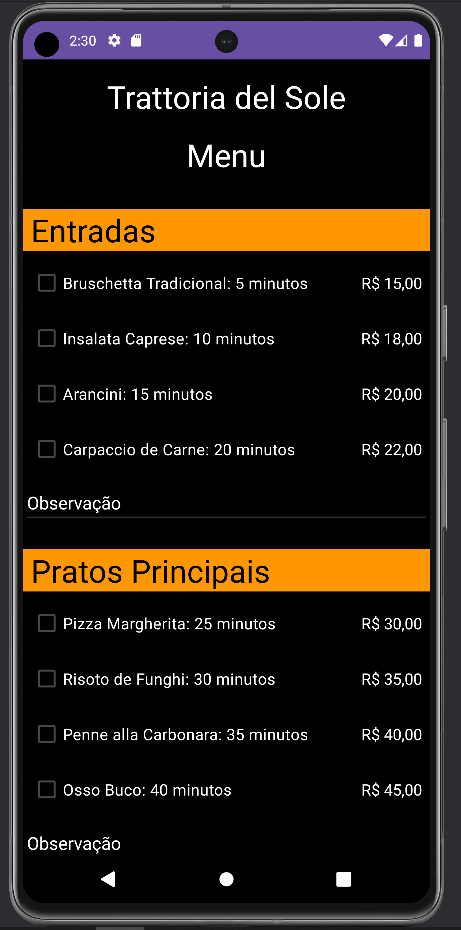
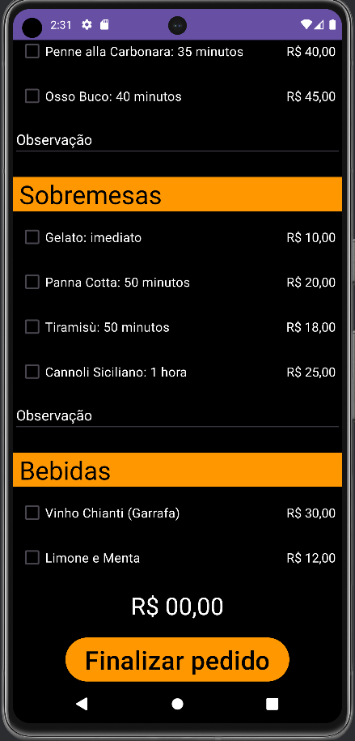
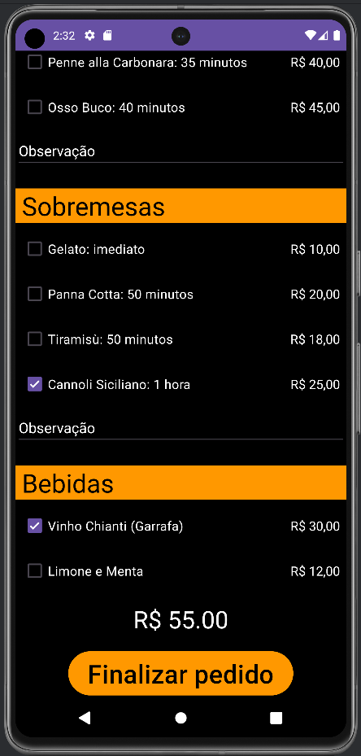
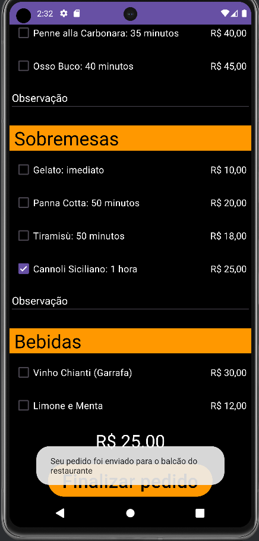
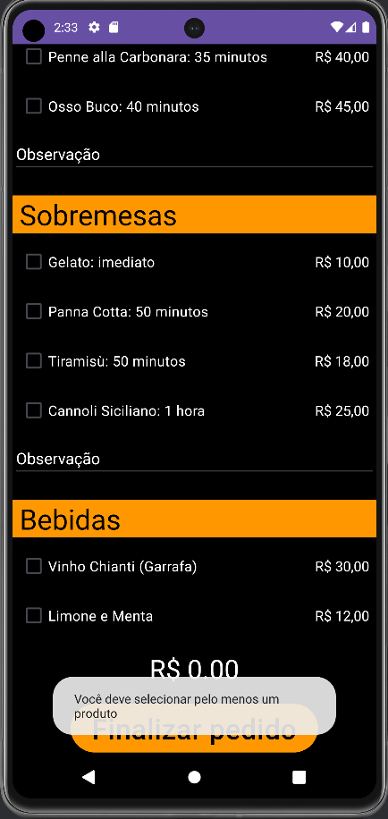

# Aplicativo De Cardapio
Este repositório é responsável pelo trabalho final do curso de Desenvolvimento Android do projeto Residência TIC. O trabalho final, intitulado "Write Code", envolve a criação de um aplicativo de cardápio de restaurante

# Sobre o Aplicativo
O aplicativo foi desenvolvido utilizando LinearLayout como estrutura principal de layout, proporcionando uma disposição organizada dos elementos na tela. Além disso, foi implementado um ScrollView para permitir o efeito de rolagem, garantindo uma melhor experiência ao usuário ao navegar pelo cardápio extenso do restaurante. Para manter uma apresentação uniforme, foram utilizados elementos CheckBox e TextView dispostos horizontalmente, mantendo um alinhamento visualmente agradável.

No final do aplicativo, foi adicionado um TextView responsável por exibir o valor total do pedido, com funcionalidades para incrementar e decrementar esse valor conforme o usuário realiza suas seleções. Adicionalmente, foi inserido um botão que, ao ser acionado, envia uma notificação em tela. Se houver pelo menos um item marcado no pedido, a notificação informa ao usuário que o pedido foi enviado com sucesso. No entanto, se nenhum item estiver marcado, a notificação alerta o usuário a selecionar pelo menos um item antes de enviar o pedido. Essas funcionalidades visam proporcionar uma interação intuitiva e informativa ao usuário durante o processo de seleção de itens do cardápio.

